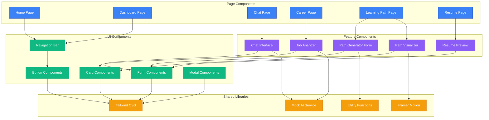
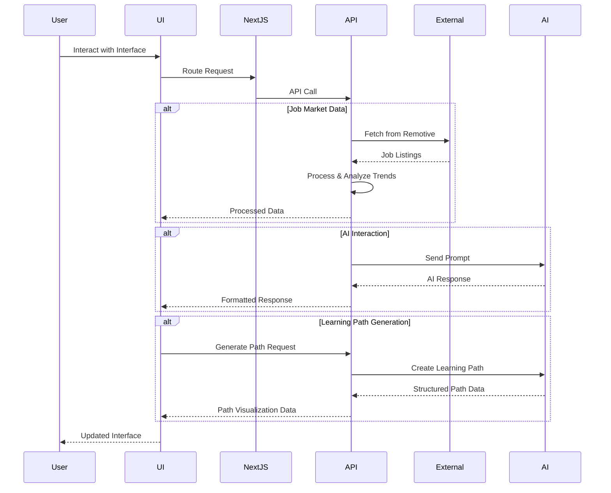
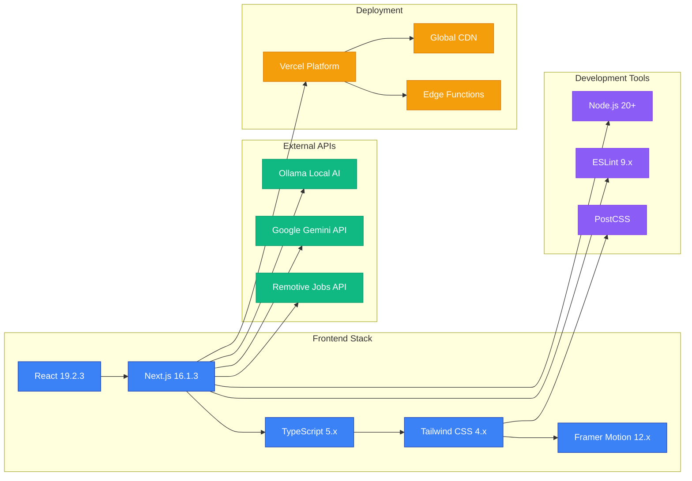
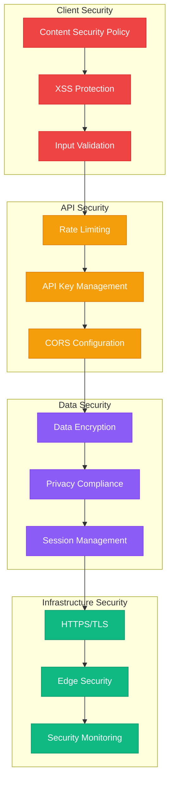
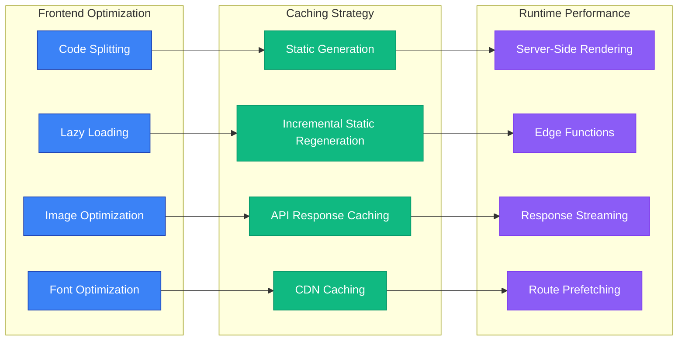
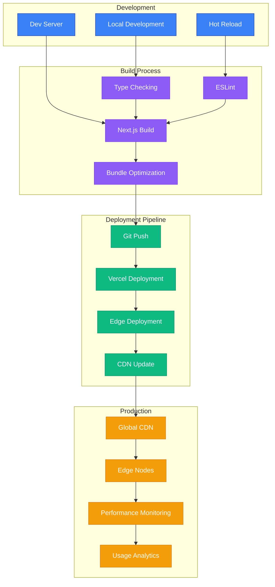
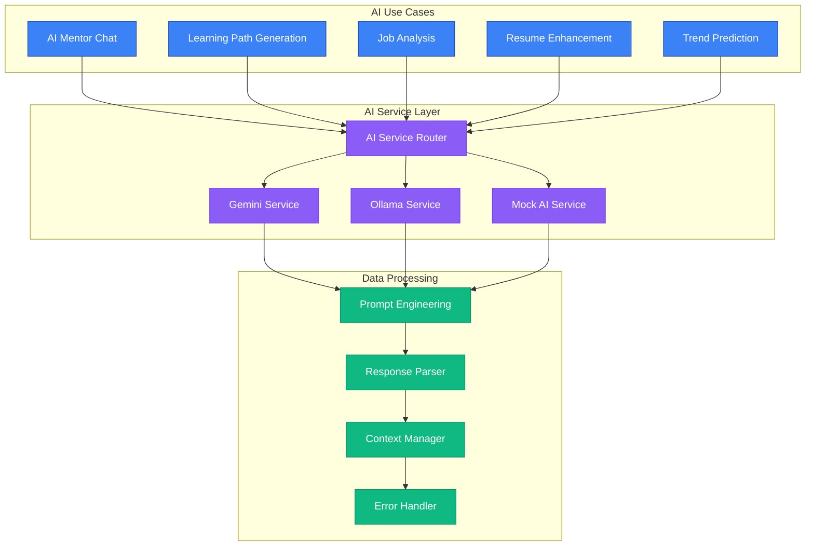

# Navixa Architecture Diagram

## System Architecture Overview

```mermaid
graph TB
    subgraph "Client Layer"
        UI[React UI Components]
        Pages[Next.js Pages]
        State[Client State Management]
    end

    subgraph "Application Layer"
        Router[Next.js App Router]
        Middleware[Middleware Layer]
        SSR[Server-Side Rendering]
    end

    subgraph "API Layer"
        APIRoutes[Next.js API Routes]
        JobsAPI[/api/jobs]
        GeminiAPI[/api/gemini]
        OllamaAPI[/api/ollama]
    end

    subgraph "External Services"
        Remotive[Remotive Jobs API]
        GoogleAI[Google Gemini API]
        LocalAI[Ollama Local AI]
    end

    subgraph "Data Processing"
        JobProcessor[Job Data Processor]
        TrendAnalyzer[Trend Analyzer]
        AIResponseHandler[AI Response Handler]
    end

    UI --> Router
    Pages --> Router
    State --> UI
    Router --> APIRoutes
    SSR --> Pages
    
    APIRoutes --> JobsAPI
    APIRoutes --> GeminiAPI
    APIRoutes --> OllamaAPI
    
    JobsAPI --> JobProcessor
    JobsAPI --> TrendAnalyzer
    GeminiAPI --> AIResponseHandler
    OllamaAPI --> AIResponseHandler
    
    JobProcessor --> Remotive
    AIResponseHandler --> GoogleAI
    AIResponseHandler --> LocalAI
    TrendAnalyzer --> JobProcessor

    classDef clientLayer fill:#3b82f6,stroke:#1e40af,color:#fff
    classDef appLayer fill:#8b5cf6,stroke:#7c3aed,color:#fff
    classDef apiLayer fill:#10b981,stroke:#059669,color:#fff
    classDef externalLayer fill:#f59e0b,stroke:#d97706,color:#fff
    classDef dataLayer fill:#ef4444,stroke:#dc2626,color:#fff

    class UI,Pages,State clientLayer
    class Router,Middleware,SSR appLayer
    class APIRoutes,JobsAPI,GeminiAPI,OllamaAPI apiLayer
    class Remotive,GoogleAI,LocalAI externalLayer
    class JobProcessor,TrendAnalyzer,AIResponseHandler dataLayer
```

## Component Architecture



## Data Flow Architecture



## Technology Stack Architecture



## File Structure Architecture

```
navixa/
├── 📁 src/
│   ├── 📁 app/                    # Next.js App Router
│   │   ├── 📁 api/               # API Routes
│   │   │   ├── 📁 gemini/        # Google AI Integration
│   │   │   ├── 📁 jobs/          # Job Market Data
│   │   │   └── 📁 ollama/        # Local AI Integration
│   │   ├── 📁 career/            # Career Intelligence Page
│   │   ├── 📁 chat/              # AI Mentor Chat
│   │   ├── 📁 dashboard/         # User Dashboard
│   │   ├── 📁 learning-path/     # Learning Path Generator
│   │   ├── 📁 resume/            # Resume Builder
│   │   ├── 📄 globals.css        # Global Styles
│   │   ├── 📄 layout.tsx         # Root Layout
│   │   └── 📄 page.tsx           # Home Page
│   ├── 📁 components/            # React Components
│   │   ├── 📁 features/          # Feature-specific Components
│   │   │   ├── 📄 PathGeneratorForm.tsx
│   │   │   ├── 📄 PathVisualizer.tsx
│   │   │   └── 📄 ResumePreview.tsx
│   │   └── 📁 ui/                # Reusable UI Components
│   │       └── 📄 navbar.tsx
│   └── 📁 lib/                   # Shared Libraries
│       ├── 📄 mock-ai.ts         # AI Service Mock
│       └── 📄 utils.ts           # Utility Functions
├── 📁 public/                    # Static Assets
├── 📄 package.json              # Dependencies
├── 📄 next.config.ts            # Next.js Configuration
├── 📄 tailwind.config.js        # Tailwind Configuration
├── 📄 tsconfig.json             # TypeScript Configuration
└── 📄 postcss.config.mjs        # PostCSS Configuration
```

## Security Architecture



## Performance Architecture



## Deployment Architecture



## AI Integration Architecture



---

*This architecture diagram provides a comprehensive view of Navixa's system design, component relationships, and technical infrastructure. It serves as a reference for understanding the application's structure and can guide future development and scaling decisions.*