# Navixa Features Diagram

## Complete Feature Overview

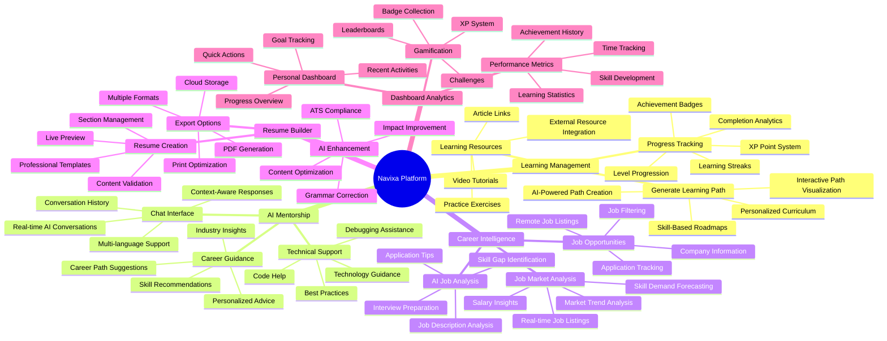

## Feature Categories Breakdown

### 🎓 **Learning Management Features**

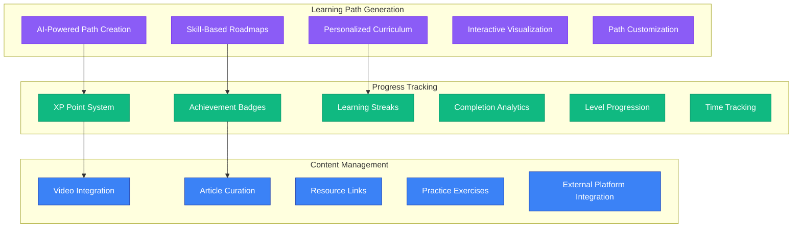

### 🤖 **AI Mentorship Features**

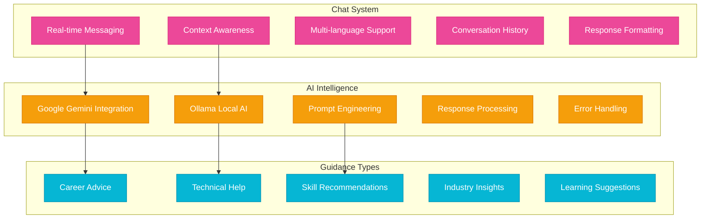

### 💼 **Career Intelligence Features**

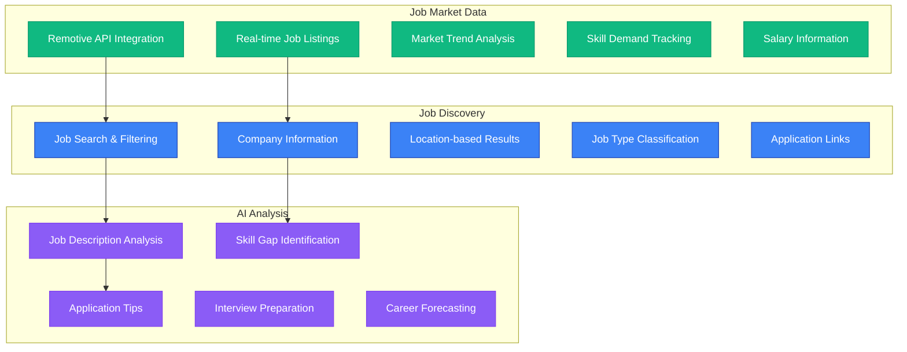

### 📄 **Resume Builder Features**

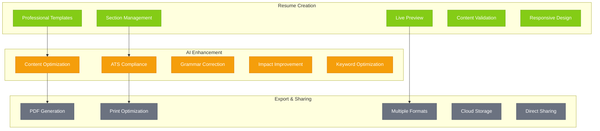

### 📊 **Dashboard & Analytics Features**

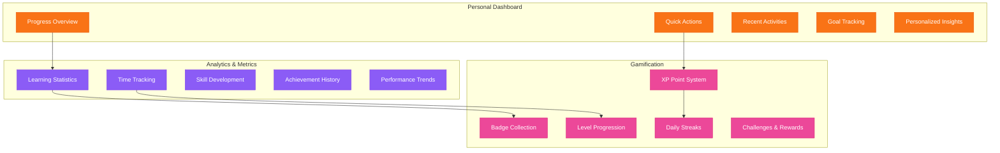

## Feature Implementation Status

### ✅ **Implemented Features (Current)**

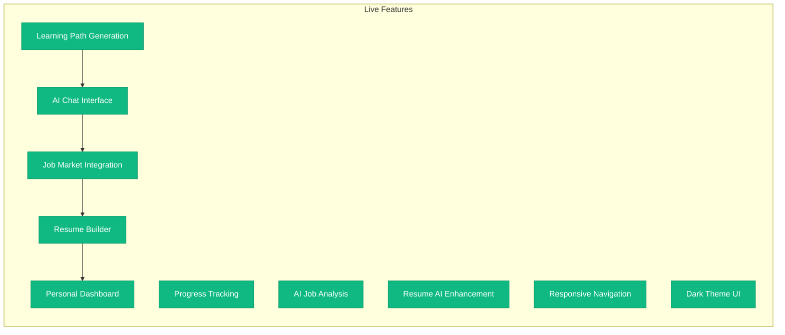

### 🚧 **Planned Features (Roadmap)**

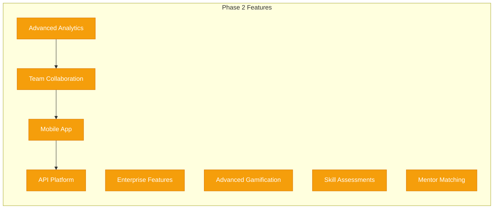

## Feature Priority Matrix

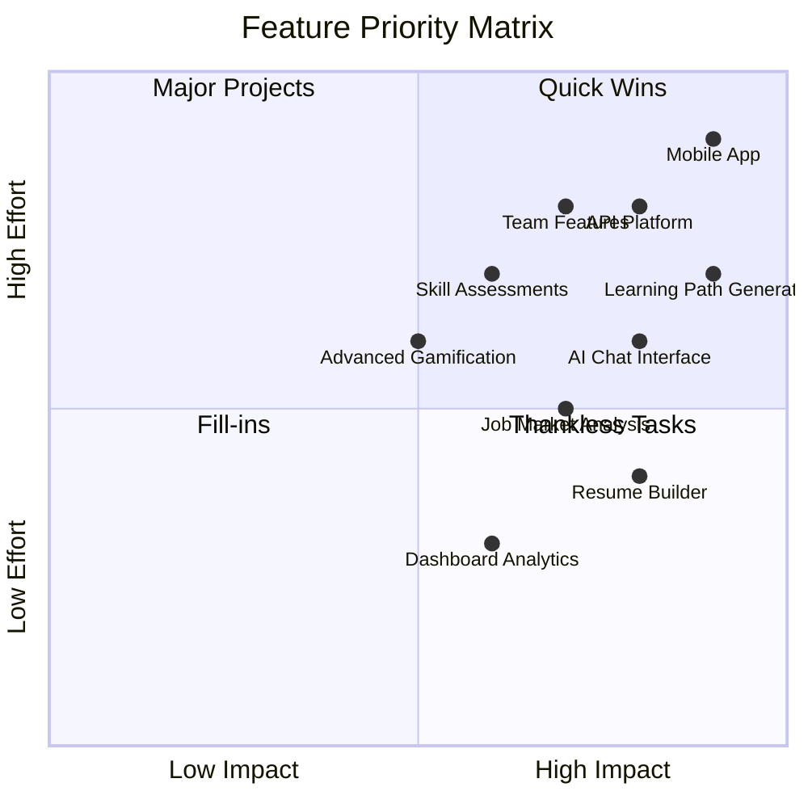

## Technical Feature Architecture

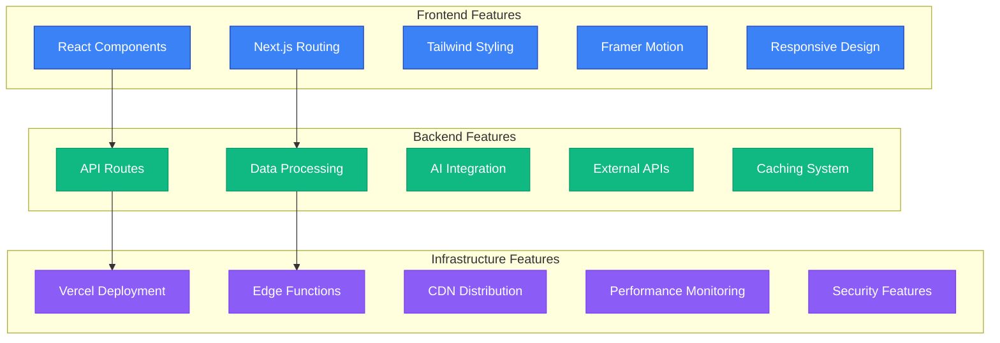

## Feature Integration Map

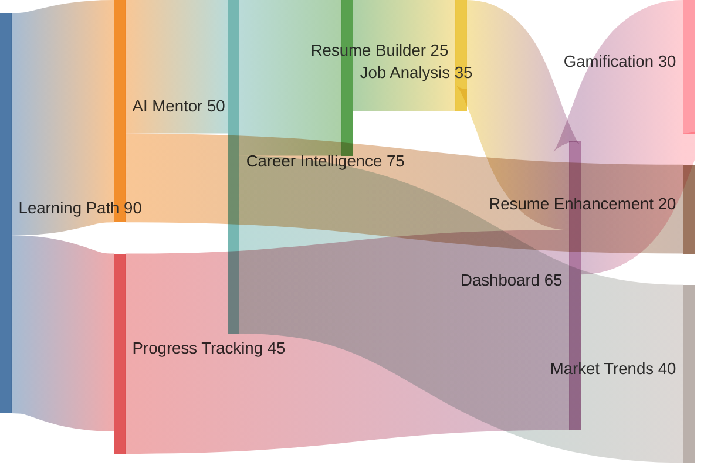

## User Feature Adoption Flow

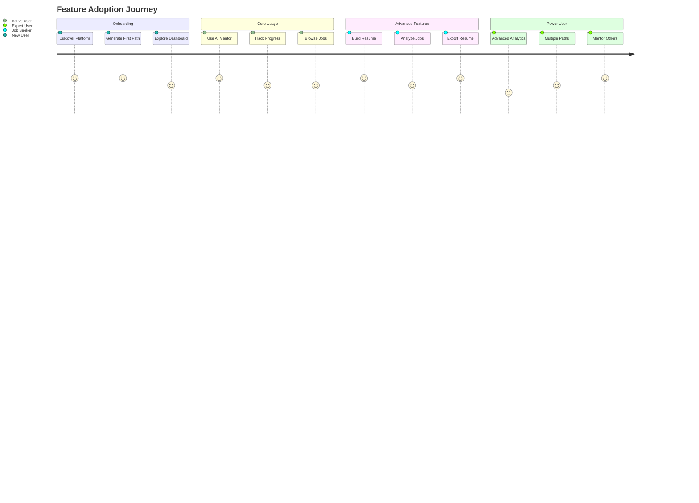

---

*This comprehensive feature diagram provides a complete overview of all Navixa platform capabilities, their relationships, implementation status, and strategic priorities for development planning.*