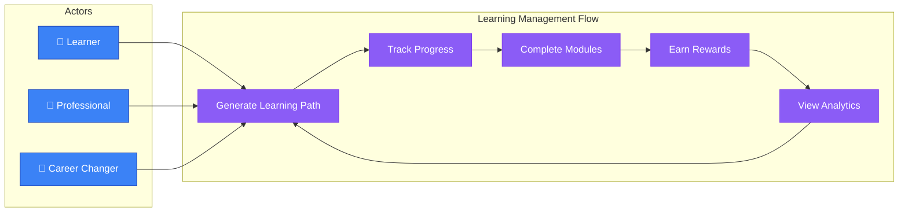
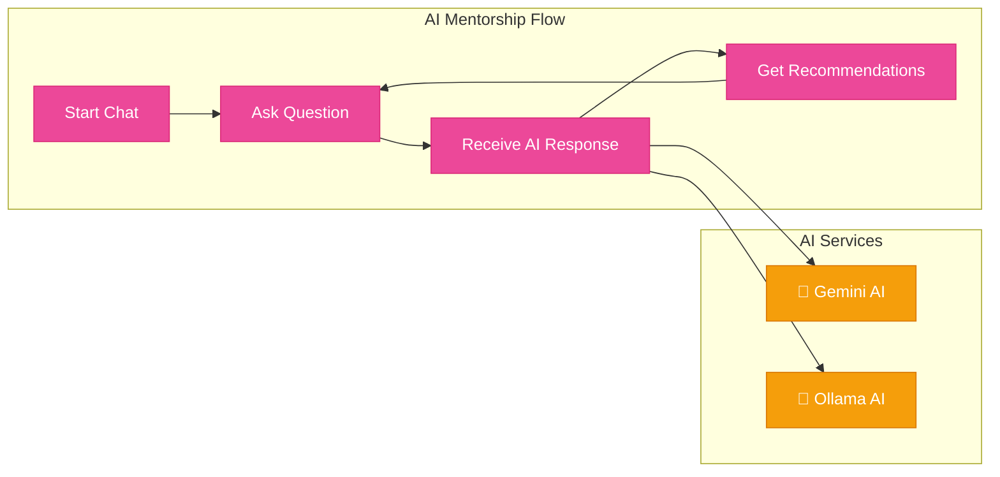
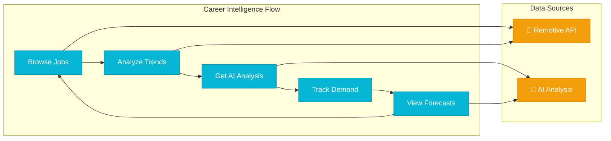
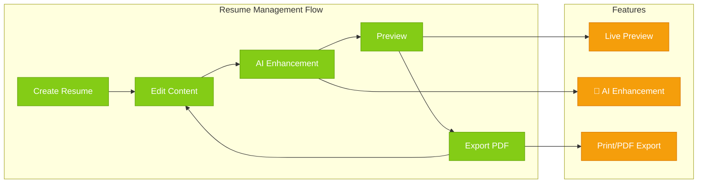
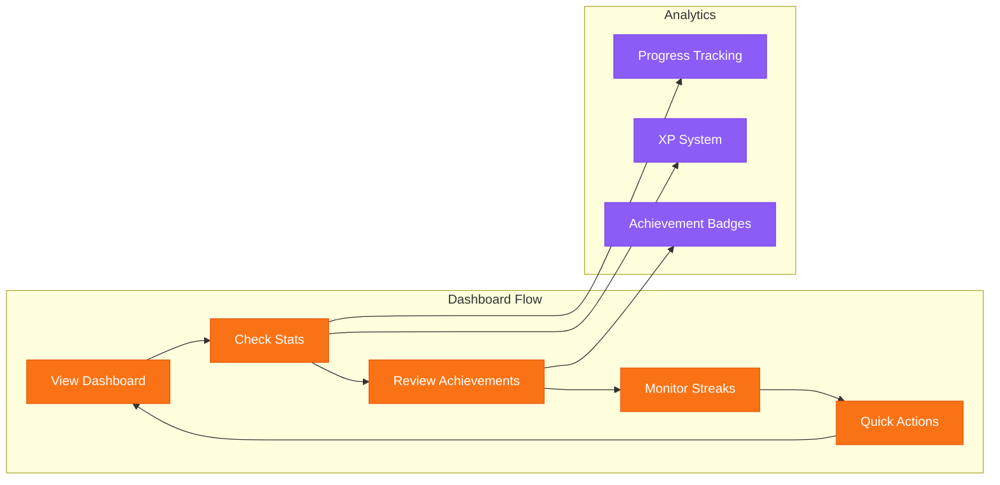
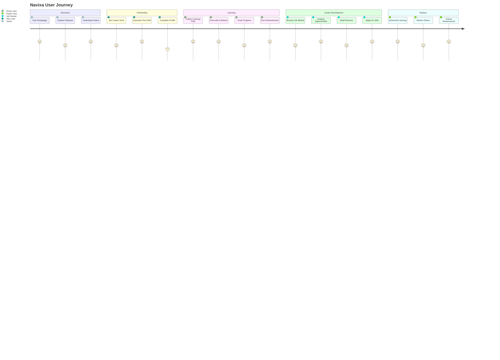

# Navixa Use Case Diagram

## System Use Case Overview

```mermaid
graph TB
    subgraph "Navixa Career Development Platform"
        subgraph "Learning Management"
            UC1[Generate Learning Path]
            UC2[Track Learning Progress]
            UC3[Complete Learning Modules]
            UC4[Earn XP and Badges]
            UC5[View Learning Analytics]
        end

        subgraph "AI Mentorship"
            UC6[Chat with AI Mentor]
            UC7[Get Career Advice]
            UC8[Ask Technical Questions]
            UC9[Receive Personalized Guidance]
            UC10[Get Skill Recommendations]
        end

        subgraph "Career Intelligence"
            UC11[Browse Job Opportunities]
            UC12[Analyze Job Market Trends]
            UC13[Get AI Job Analysis]
            UC14[Track Skill Demand]
            UC15[View Career Forecasts]
        end

        subgraph "Resume Management"
            UC16[Create Resume]
            UC17[Edit Resume Content]
            UC18[AI Resume Enhancement]
            UC19[Preview Resume]
            UC20[Export Resume PDF]
        end

        subgraph "Dashboard & Analytics"
            UC21[View Personal Dashboard]
            UC22[Monitor Progress Stats]
            UC23[Check Achievement Status]
            UC24[Review Learning Streaks]
            UC25[Access Quick Actions]
        end

        subgraph "System Management"
            UC26[Navigate Between Features]
            UC27[Manage User Preferences]
            UC28[Handle Responsive Layout]
            UC29[Process API Requests]
            UC30[Manage Data Caching]
        end
    end

    %% Actors
    Learner[👤 Learner/Student]
    Professional[👤 Working Professional]
    CareerChanger[👤 Career Changer]
    JobSeeker[👤 Job Seeker]
    
    %% External Systems
    RemotiveAPI[🔗 Remotive Jobs API]
    GeminiAI[🤖 Google Gemini AI]
    OllamaAI[🤖 Ollama Local AI]

    %% User Interactions - Learning Management
    Learner --> UC1
    Learner --> UC2
    Learner --> UC3
    Learner --> UC4
    Professional --> UC1
    Professional --> UC5
    CareerChanger --> UC1
    CareerChanger --> UC2

    %% User Interactions - AI Mentorship
    Learner --> UC6
    Learner --> UC7
    Professional --> UC8
    Professional --> UC9
    CareerChanger --> UC6
    CareerChanger --> UC10
    JobSeeker --> UC7
    JobSeeker --> UC9

    %% User Interactions - Career Intelligence
    Professional --> UC11
    Professional --> UC12
    JobSeeker --> UC11
    JobSeeker --> UC13
    CareerChanger --> UC14
    CareerChanger --> UC15
    Learner --> UC12

    %% User Interactions - Resume Management
    JobSeeker --> UC16
    JobSeeker --> UC17
    JobSeeker --> UC18
    JobSeeker --> UC19
    JobSeeker --> UC20
    Professional --> UC16
    Professional --> UC18
    CareerChanger --> UC16
    CareerChanger --> UC17

    %% User Interactions - Dashboard
    Learner --> UC21
    Learner --> UC22
    Professional --> UC21
    Professional --> UC23
    CareerChanger --> UC24
    CareerChanger --> UC25
    JobSeeker --> UC21
    JobSeeker --> UC22

    %% System Interactions
    UC1 --> GeminiAI
    UC6 --> GeminiAI
    UC7 --> GeminiAI
    UC8 --> OllamaAI
    UC9 --> GeminiAI
    UC10 --> GeminiAI
    UC11 --> RemotiveAPI
    UC12 --> RemotiveAPI
    UC13 --> GeminiAI
    UC14 --> RemotiveAPI
    UC15 --> GeminiAI
    UC18 --> GeminiAI

    %% Styling
    classDef actor fill:#3b82f6,stroke:#1e40af,color:#fff
    classDef usecase fill:#10b981,stroke:#059669,color:#fff
    classDef external fill:#f59e0b,stroke:#d97706,color:#fff
    classDef learning fill:#8b5cf6,stroke:#7c3aed,color:#fff
    classDef ai fill:#ec4899,stroke:#db2777,color:#fff
    classDef career fill:#06b6d4,stroke:#0891b2,color:#fff
    classDef resume fill:#84cc16,stroke:#65a30d,color:#fff
    classDef dashboard fill:#f97316,stroke:#ea580c,color:#fff
    classDef system fill:#6b7280,stroke:#4b5563,color:#fff

    class Learner,Professional,CareerChanger,JobSeeker actor
    class RemotiveAPI,GeminiAI,OllamaAI external
    class UC1,UC2,UC3,UC4,UC5 learning
    class UC6,UC7,UC8,UC9,UC10 ai
    class UC11,UC12,UC13,UC14,UC15 career
    class UC16,UC17,UC18,UC19,UC20 resume
    class UC21,UC22,UC23,UC24,UC25 dashboard
    class UC26,UC27,UC28,UC29,UC30 system
```

## Detailed Use Case Specifications

### **Actor Definitions**

#### Primary Actors
- **👤 Learner/Student**: New to the field, seeking structured learning paths
- **👤 Working Professional**: Employed, looking to upskill or advance career
- **👤 Career Changer**: Transitioning between industries or roles
- **👤 Job Seeker**: Actively searching for employment opportunities

#### Secondary Actors (External Systems)
- **🔗 Remotive Jobs API**: Provides real-time job market data
- **🤖 Google Gemini AI**: Cloud-based AI for advanced processing
- **🤖 Ollama Local AI**: Local AI model for privacy-focused interactions

### **Use Case Categories**

## 1. Learning Management Use Cases

### **UC1: Generate Learning Path**
- **Primary Actor**: Learner, Professional, Career Changer
- **Goal**: Create personalized learning roadmap
- **Preconditions**: User has defined learning goal
- **Main Flow**:
  1. User enters career goal or skill target
  2. System processes goal using AI
  3. AI generates structured learning path
  4. System displays interactive path visualization
  5. User can customize or accept the path

### **UC2: Track Learning Progress**
- **Primary Actor**: Learner, Professional, Career Changer
- **Goal**: Monitor advancement through learning materials
- **Main Flow**:
  1. User accesses dashboard
  2. System displays progress metrics
  3. User views completion percentages
  4. System shows XP earned and streaks

## 2. AI Mentorship Use Cases

### **UC6: Chat with AI Mentor**
- **Primary Actor**: All user types
- **Goal**: Get real-time career and technical guidance
- **Main Flow**:
  1. User opens chat interface
  2. User types question or request
  3. System routes to appropriate AI service
  4. AI processes query with context
  5. System displays formatted response

### **UC7: Get Career Advice**
- **Primary Actor**: Learner, Job Seeker, Career Changer
- **Goal**: Receive personalized career guidance
- **Main Flow**:
  1. User asks career-related question
  2. AI analyzes user profile and market data
  3. AI provides tailored advice
  4. System suggests actionable next steps

## 3. Career Intelligence Use Cases

### **UC11: Browse Job Opportunities**
- **Primary Actor**: Professional, Job Seeker
- **Goal**: Discover relevant job openings
- **Main Flow**:
  1. User accesses career page
  2. System fetches latest job listings
  3. User browses filtered opportunities
  4. User can apply or analyze jobs

### **UC13: Get AI Job Analysis**
- **Primary Actor**: Job Seeker, Professional
- **Goal**: Receive intelligent job opportunity assessment
- **Main Flow**:
  1. User selects job listing
  2. User clicks "Analyze with AI"
  3. AI processes job description and requirements
  4. System displays analysis with insights
  5. User receives application tips

## 4. Resume Management Use Cases

### **UC16: Create Resume**
- **Primary Actor**: Job Seeker, Professional, Career Changer
- **Goal**: Build professional resume
- **Main Flow**:
  1. User accesses resume builder
  2. User fills in personal information
  3. User adds experience and skills
  4. System provides live preview
  5. User saves resume data

### **UC18: AI Resume Enhancement**
- **Primary Actor**: Job Seeker, Professional, Career Changer
- **Goal**: Improve resume content with AI assistance
- **Main Flow**:
  1. User clicks "Enhance with AI"
  2. AI analyzes current content
  3. AI generates improved versions
  4. System updates resume sections
  5. User reviews and accepts changes

## 5. Dashboard & Analytics Use Cases

### **UC21: View Personal Dashboard**
- **Primary Actor**: All user types
- **Goal**: Access centralized progress overview
- **Main Flow**:
  1. User navigates to dashboard
  2. System displays personalized metrics
  3. User views current learning status
  4. System shows recent activities
  5. User accesses quick action buttons

## User Journey Mapping

## Use Case Priorities

### **High Priority (MVP)**
1. **UC1**: Generate Learning Path
2. **UC6**: Chat with AI Mentor
3. **UC11**: Browse Job Opportunities
4. **UC16**: Create Resume
5. **UC21**: View Personal Dashboard

### **Medium Priority (Phase 2)**
1. **UC2**: Track Learning Progress
2. **UC7**: Get Career Advice
3. **UC13**: Get AI Job Analysis
4. **UC18**: AI Resume Enhancement
5. **UC22**: Monitor Progress Stats

### **Low Priority (Future Enhancements)**
1. **UC5**: View Learning Analytics
2. **UC15**: View Career Forecasts
3. **UC25**: Access Quick Actions
4. **UC30**: Manage Data Caching

## Success Metrics by Use Case

### **Learning Management**
- Path completion rate: >60%
- User engagement: >70% weekly return
- XP progression: Average 100+ XP per week

### **AI Mentorship**
- Chat session length: >5 minutes average
- User satisfaction: >4.5/5 rating
- Response accuracy: >90% helpful responses

### **Career Intelligence**
- Job application rate: >20% of viewed jobs
- Market insight usage: >50% of users
- Trend prediction accuracy: >80%

### **Resume Management**
- Resume completion rate: >80%
- AI enhancement adoption: >60%
- Export/print usage: >70%

---

*This use case diagram provides a comprehensive view of all user interactions with the Navixa platform, serving as a foundation for feature development, testing scenarios, and user experience optimization.*