# Navixa Wireframes & UI Mockups

## Overview
This document contains wireframes and UI mockups for all major pages and components of the Navixa platform using Mermaid diagrams. Each wireframe shows layout structure, component placement, and interaction patterns.

---

## 1. Home Page (Landing Page)

### Desktop Layout
```mermaid
graph TB
    subgraph Header["Navigation Bar - Fixed Top"]
        Logo[Navixa Logo]
        Nav1[Dashboard]
        Nav2[Chat]
        Nav3[Career]
        Nav4[Learning Path]
        Nav5[Resume]
    end
    
    subgraph Hero["Hero Section"]
        Title["AI-Powered Career Development<br/>Platform for Developers"]
        Subtitle["Transform your career with personalized learning paths,<br/>AI mentorship, and real-time job market insights"]
        CTA1[Get Started →]
        CTA2[Learn More]
    end
    
    subgraph Features["Feature Grid - 3 Columns"]
        F1["🎯 Learning Paths<br/>Personalized roadmaps<br/>tailored to your goals"]
        F2["🤖 AI Mentor Chat<br/>24/7 AI guidance for<br/>career questions"]
        F3["💼 Career Intelligence<br/>Real-time job market<br/>data & trends"]
        F4["📄 Resume Builder<br/>ATS-optimized resume<br/>with AI enhancement"]
        F5["📊 Dashboard Analytics<br/>Track progress with<br/>XP & achievements"]
        F6["⚡ Progress Tracking<br/>Gamified learning<br/>with streaks & badges"]
    end
    
    subgraph Footer["Footer Section"]
        FooterLinks[About | Contact | Privacy | Terms]
        Copyright["© 2026 Navixa"]
    end
    
    Header --> Hero
    Hero --> Features
    Features --> Footer
    
    classDef headerStyle fill:#18181b,stroke:#3b82f6,color:#fff
    classDef heroStyle fill:#27272a,stroke:#8b5cf6,color:#fff
    classDef featureStyle fill:#18181b,stroke:#10b981,color:#fff
    classDef footerStyle fill:#09090b,stroke:#52525b,color:#a1a1aa
    
    class Header headerStyle
    class Hero heroStyle
    class Features featureStyle
    class Footer footerStyle
```

### Mobile Layout (< 768px)
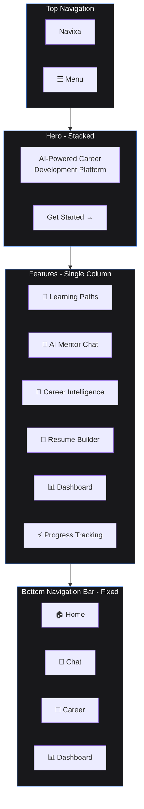

---

## 2. Dashboard Page

### Desktop Layout
```mermaid
graph TB
    subgraph DashNav["Navigation Bar"]
        DLogo[Navixa]
        DNav[Dashboard | Chat | Career | Learning | Resume]
    end
    
    subgraph DashHeader["Dashboard Header"]
        Welcome["Welcome back, User!"]
        DateInfo["Sunday, March 1, 2026"]
    end
    
    subgraph StatsRow["Stats Cards - 4 Columns"]
        Stat1["🔥 Current Streak<br/>7 days"]
        Stat2["⭐ Total XP<br/>2,450 points"]
        Stat3["📚 Courses<br/>3 in progress"]
        Stat4["🎯 Level<br/>Level 5"]
    end
    
    subgraph MainContent["Main Content - 2 Column Layout"]
        direction LR
        LeftCol["Learning Progress<br/>━━━━━━━━░░ 75%<br/><br/>Recent Achievements<br/>🏆 First Week<br/>🎓 Quick Learner<br/>⚡ Speed Demon<br/><br/>Active Learning Paths<br/>• React Advanced<br/>• System Design<br/>• TypeScript Mastery"]
        RightCol["Recommended Actions<br/>→ Continue React Course<br/>→ Take Daily Challenge<br/>→ Update Resume<br/><br/>Job Market Insights<br/>📈 React: High Demand<br/>📈 TypeScript: Growing<br/>📊 Remote: 234 jobs<br/><br/>Quick Stats<br/>Time Invested: 24h<br/>Completion Rate: 85%"]
    end
    
    DashNav --> DashHeader
    DashHeader --> StatsRow
    StatsRow --> MainContent
    
    classDef navStyle fill:#18181b,stroke:#3b82f6,color:#fff
    classDef headerStyle fill:#27272a,stroke:#8b5cf6,color:#fff
    classDef statsStyle fill:#18181b,stroke:#10b981,color:#fff
    classDef contentStyle fill:#18181b,stroke:#3b82f6,color:#fff
    
    class DashNav navStyle
    class DashHeader headerStyle
    class StatsRow statsStyle
    class MainContent contentStyle
```


---

## 3. AI Mentor Chat Page

### Desktop Layout
```mermaid
graph TB
    subgraph ChatNav["Navigation Bar"]
        CNavLogo[Navixa]
        CNavLinks[Dashboard | Chat | Career | Learning | Resume]
    end
    
    subgraph ChatContainer["Chat Interface - Full Height"]
        direction TB
        ChatHeader["AI Mentor Chat<br/>Select AI: [Gemini ▼] [Ollama]"]
        
        ChatMessages["Chat Messages Area<br/>━━━━━━━━━━━━━━━━━━━━━━<br/>🤖 AI: Hello! How can I help?<br/><br/>👤 You: Help me learn React<br/><br/>🤖 AI: I'll create a learning path...<br/>━━━━━━━━━━━━━━━━━━━━━━"]
        
        ChatInput["┌─────────────────────────────┐<br/>│ Type your message...        │<br/>│                      [Send →]│<br/>└─────────────────────────────┘"]
    end
    
    subgraph ChatSidebar["Sidebar - Suggestions"]
        Suggestions["Quick Actions<br/>• Generate Learning Path<br/>• Career Advice<br/>• Resume Tips<br/>• Job Market Insights<br/><br/>Recent Topics<br/>• React Hooks<br/>• System Design<br/>• Interview Prep"]
    end
    
    ChatNav --> ChatContainer
    ChatContainer -.-> ChatSidebar
    
    classDef chatStyle fill:#18181b,stroke:#8b5cf6,color:#fff
    class ChatNav,ChatContainer,ChatSidebar chatStyle
```

### Mobile Layout
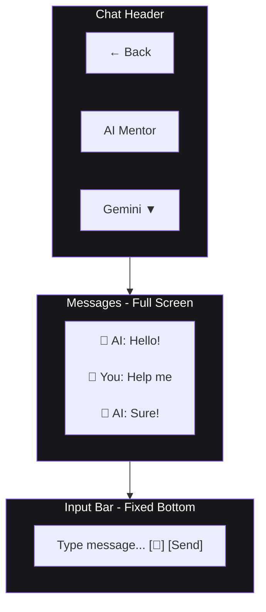

---

## 4. Learning Path Generator Page

### Desktop Layout
```mermaid
graph TB
    subgraph LPNav["Navigation Bar"]
        LPLogo[Navixa]
        LPLinks[Dashboard | Chat | Career | Learning | Resume]
    end
    
    subgraph LPHeader["Page Header"]
        LPTitle["Generate Your Learning Path"]
        LPSubtitle["AI-powered personalized roadmap"]
    end
    
    subgraph LPForm["Path Generator Form - Left Side"]
        FormTitle["Create Learning Path"]
        Input1["Goal: [What do you want to learn?]"]
        Input2["Current Level: [Beginner ▼]"]
        Input3["Time Commitment: [10 hours/week]"]
        Input4["Focus Areas: [Frontend, Backend, etc.]"]
        GenerateBtn["[Generate Path →]"]
    end
    
    subgraph LPVisualizer["Path Visualization - Right Side"]
        VisTitle["Your Learning Path"]
        PathGraph["     ┌─────────┐<br/>     │ Start   │<br/>     └────┬────┘<br/>          │<br/>     ┌────▼────┐<br/>     │ Basics  │<br/>     └────┬────┘<br/>          │<br/>     ┌────▼────┐<br/>     │Advanced │<br/>     └────┬────┘<br/>          │<br/>     ┌────▼────┐<br/>     │ Master  │<br/>     └─────────┘"]
        PathDetails["• 12 weeks duration<br/>• 5 modules<br/>• 20 resources<br/>• Estimated: 120 hours"]
    end
    
    LPNav --> LPHeader
    LPHeader --> LPForm
    LPHeader --> LPVisualizer
    
    classDef lpStyle fill:#18181b,stroke:#10b981,color:#fff
    class LPNav,LPHeader,LPForm,LPVisualizer lpStyle
```

### Path Visualization Detail
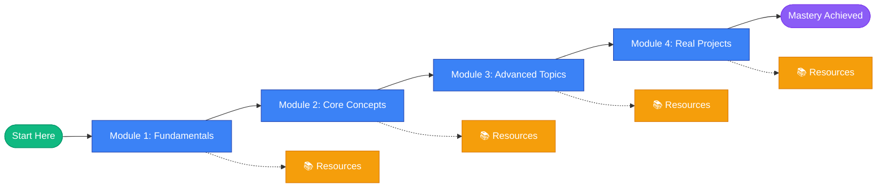

---

## 5. Career Intelligence Page

### Desktop Layout
```mermaid
graph TB
    subgraph CareerNav["Navigation Bar"]
        CRNavLogo[Navixa]
        CRNavLinks[Dashboard | Chat | Career | Learning | Resume]
    end
    
    subgraph CareerHeader["Career Intelligence Dashboard"]
        CRTitle["Job Market Insights & Opportunities"]
        CRFilters["Filters: [Remote ▼] [Full-time ▼] [Tech Stack ▼]"]
    end
    
    subgraph TrendSection["Market Trends - Top Section"]
        Trend1["📈 React<br/>High Demand<br/>+15% this month"]
        Trend2["📈 TypeScript<br/>Growing<br/>+22% this month"]
        Trend3["📊 Python<br/>Stable<br/>+5% this month"]
        Trend4["📉 jQuery<br/>Declining<br/>-8% this month"]
    end
    
    subgraph JobListings["Job Listings - Main Content"]
        Job1["Senior React Developer<br/>Company A • Remote • $120k-150k<br/>React, TypeScript, Node.js<br/>[View Details] [AI Analysis]"]
        Job2["Full Stack Engineer<br/>Company B • Remote • $100k-130k<br/>Python, Django, PostgreSQL<br/>[View Details] [AI Analysis]"]
        Job3["Frontend Developer<br/>Company C • Hybrid • $90k-120k<br/>Vue.js, JavaScript, CSS<br/>[View Details] [AI Analysis]"]
    end
    
    subgraph CareerSidebar["Sidebar - Insights"]
        SideTitle["Your Match Score"]
        Match1["Job 1: 85% Match"]
        Match2["Job 2: 72% Match"]
        Match3["Job 3: 68% Match"]
        Recommendations["Skill Gaps<br/>• System Design<br/>• Docker<br/>• AWS"]
    end
    
    CareerNav --> CareerHeader
    CareerHeader --> TrendSection
    TrendSection --> JobListings
    JobListings -.-> CareerSidebar
    
    classDef careerStyle fill:#18181b,stroke:#f59e0b,color:#fff
    class CareerNav,CareerHeader,TrendSection,JobListings,CareerSidebar careerStyle
```

### Job Analysis Modal
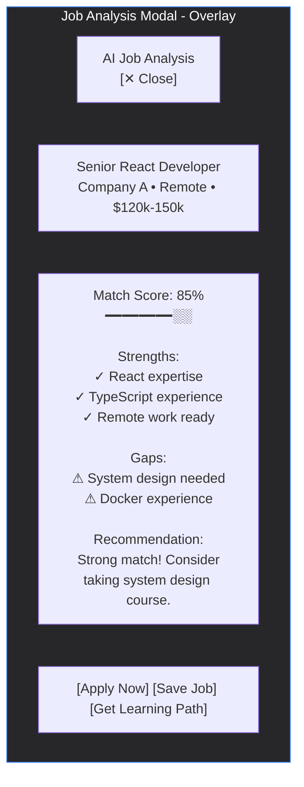

---

## 6. Resume Builder Page

### Desktop Layout
```mermaid
graph TB
    subgraph ResumeNav["Navigation Bar"]
        RNavLogo[Navixa]
        RNavLinks[Dashboard | Chat | Career | Learning | Resume]
    end
    
    subgraph ResumeHeader["Resume Builder Header"]
        RTitle["Build Your Professional Resume"]
        RActions["[Save] [Export PDF] [Print] [AI Enhance]"]
    end
    
    subgraph ResumeEditor["Editor - Left Side (50%)"]
        EditorTitle["Edit Resume"]
        
        Section1["Personal Info<br/>[Name]<br/>[Email] [Phone]<br/>[Location] [LinkedIn]"]
        
        Section2["Summary<br/>[Your professional summary...]"]
        
        Section3["Experience<br/>[+ Add Experience]<br/>• Job Title @ Company<br/>  Date - Date<br/>  Description..."]
        
        Section4["Education<br/>[+ Add Education]"]
        
        Section5["Skills<br/>[+ Add Skill]<br/>React • TypeScript • Node.js"]
    end
    
    subgraph ResumePreview["Live Preview - Right Side (50%)"]
        PreviewTitle["Live Preview"]
        
        Preview["┌─────────────────────┐<br/>│ YOUR NAME           │<br/>│ email@example.com   │<br/>│ (555) 123-4567      │<br/>├─────────────────────┤<br/>│ SUMMARY             │<br/>│ Professional...     │<br/>├─────────────────────┤<br/>│ EXPERIENCE          │<br/>│ • Job Title         │<br/>│   Company Name      │<br/>│   Description...    │<br/>├─────────────────────┤<br/>│ EDUCATION           │<br/>│ • Degree            │<br/>├─────────────────────┤<br/>│ SKILLS              │<br/>│ React • TypeScript  │<br/>└─────────────────────┘"]
    end
    
    ResumeNav --> ResumeHeader
    ResumeHeader --> ResumeEditor
    ResumeHeader --> ResumePreview
    
    classDef resumeStyle fill:#18181b,stroke:#8b5cf6,color:#fff
    class ResumeNav,ResumeHeader,ResumeEditor,ResumePreview resumeStyle
```

### AI Enhancement Modal
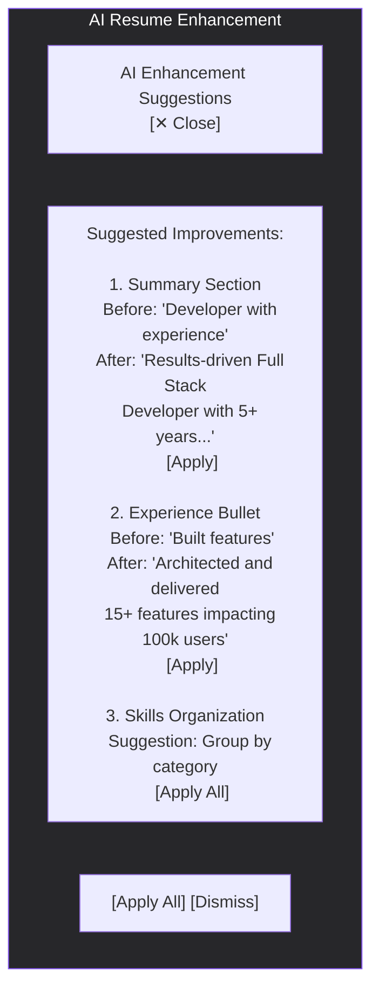


---

## 7. Component Wireframes

### Navigation Bar Component
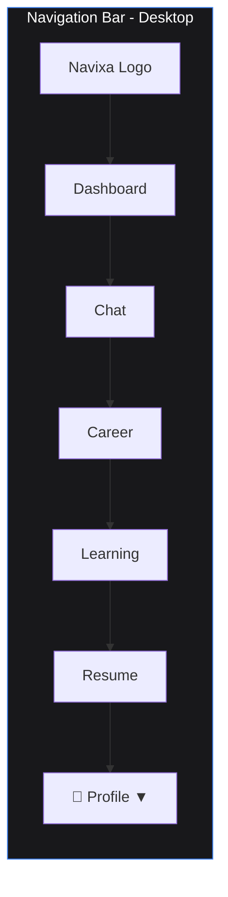

### Mobile Bottom Navigation
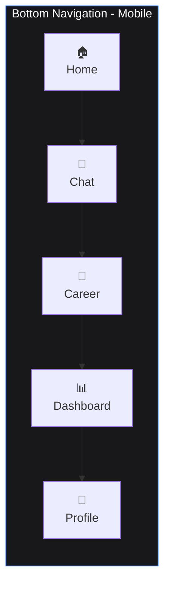

### Card Component Variations
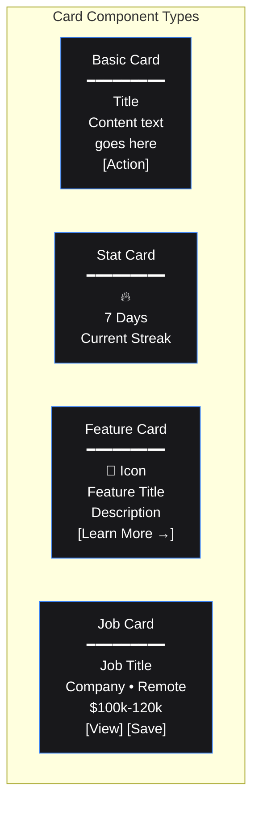

### Button Component Variations
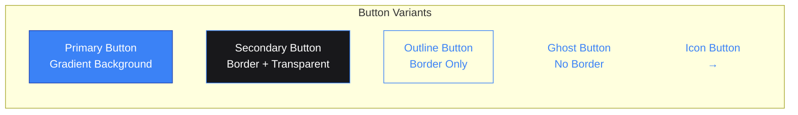

### Form Input Components
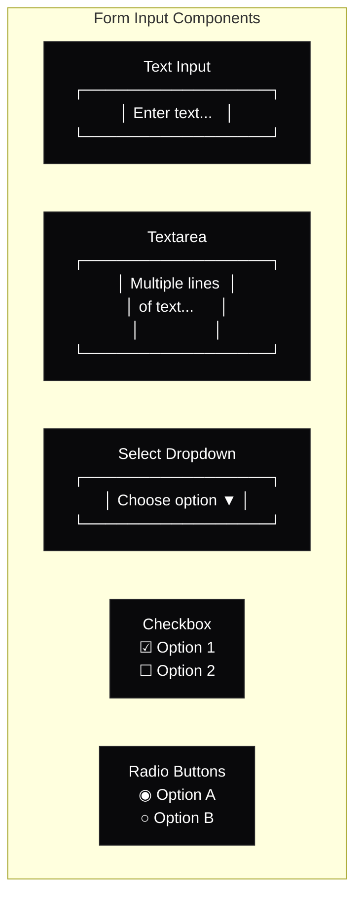

---

## 8. User Flow Diagrams

### User Onboarding Flow
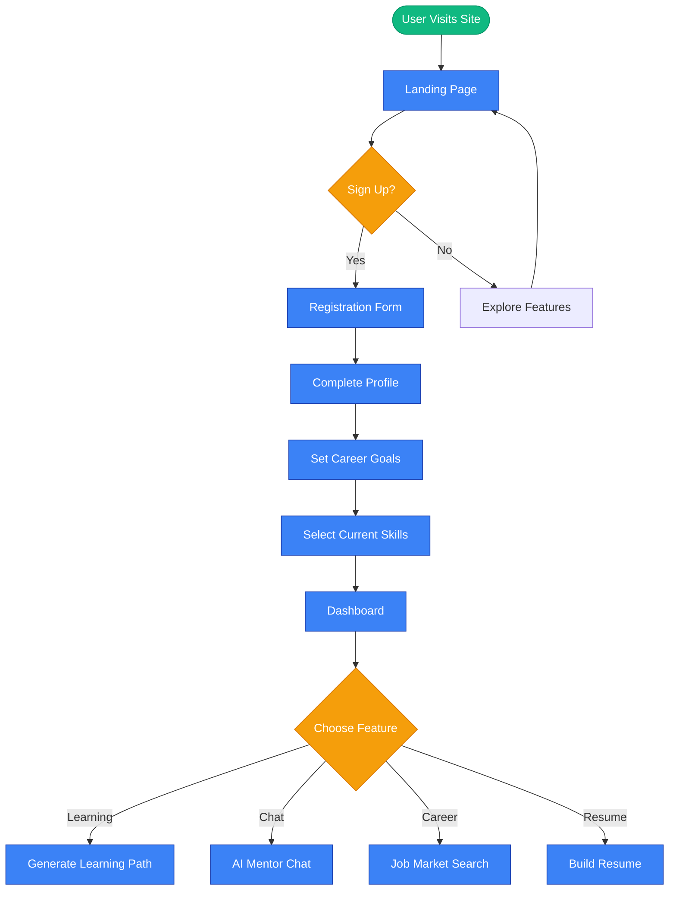

### Learning Path Generation Flow
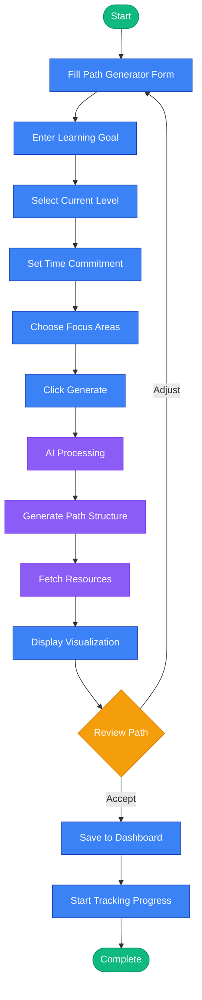

### Job Application Flow
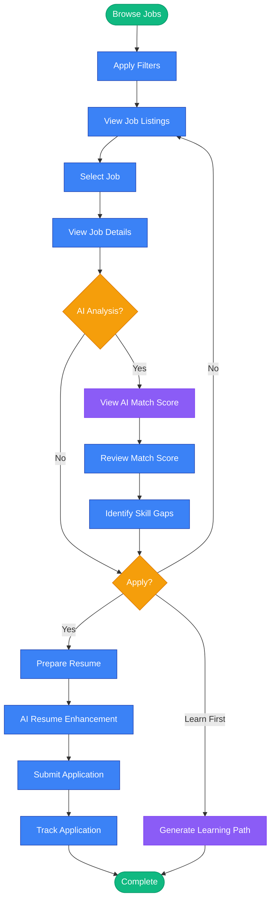

---

## 9. Responsive Breakpoints

### Layout Adaptation Strategy
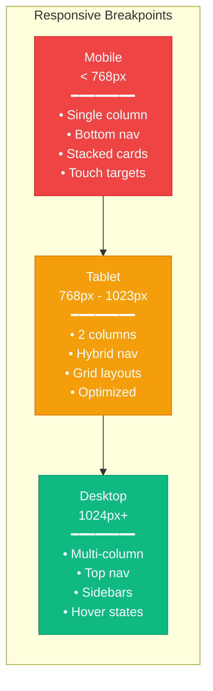

---

## 10. Interaction States

### Component State Variations
```mermaid
graph TB
    subgraph States["Interactive States"]
        Default["Default State<br/>Normal appearance"]
        Hover["Hover State<br/>Elevated, highlighted"]
        Active["Active State<br/>Pressed, selected"]
        Focus["Focus State<br/>Keyboard focus ring"]
        Disabled["Disabled State<br/>Grayed out, no interaction"]
        Loading["Loading State<br/>Spinner, skeleton"]
        Error["Error State<br/>Red border, message"]
        Success["Success State<br/>Green check, confirmation"]
    end
    
    Default --> Hover
    Hover --> Active
    Active --> Focus
    Focus --> Disabled
    Disabled --> Loading
    Loading --> Error
    Error --> Success
    
    classDef defaultStyle fill:#18181b,stroke:#3b82f6,color:#fff
    classDef hoverStyle fill:#27272a,stroke:#3b82f6,color:#fff
    classDef activeStyle fill:#3b82f6,stroke:#1e40af,color:#fff
    classDef focusStyle fill:#18181b,stroke:#8b5cf6,color:#fff
    classDef disabledStyle fill:#09090b,stroke:#52525b,color:#71717a
    classDef loadingStyle fill:#18181b,stroke:#f59e0b,color:#fff
    classDef errorStyle fill:#18181b,stroke:#ef4444,color:#fff
    classDef successStyle fill:#18181b,stroke:#10b981,color:#fff
    
    class Default defaultStyle
    class Hover hoverStyle
    class Active activeStyle
    class Focus focusStyle
    class Disabled disabledStyle
    class Loading loadingStyle
    class Error errorStyle
    class Success successStyle
```

---

## 11. Modal & Overlay Patterns

### Modal Component Structure
```mermaid
graph TB
    subgraph ModalOverlay["Modal Overlay - Full Screen"]
        Backdrop["Dark Backdrop<br/>rgba(0,0,0,0.8)"]
        
        ModalBox["Modal Container<br/>━━━━━━━━━━━━━━━<br/>┌─────────────────┐<br/>│ Header    [✕]   │<br/>├─────────────────┤<br/>│                 │<br/>│ Content Area    │<br/>│                 │<br/>├─────────────────┤<br/>│ [Cancel] [Save] │<br/>└─────────────────┘"]
    end
    
    Backdrop --> ModalBox
    
    classDef overlayStyle fill:#09090b,stroke:#3b82f6,color:#fff,opacity:0.9
    class ModalOverlay overlayStyle
```

### Toast Notification Positions
```mermaid
graph TB
    subgraph ToastPositions["Toast Notification Positions"]
        TopLeft["Top Left<br/>━━━━━━━<br/>✓ Success!"]
        TopCenter["Top Center<br/>━━━━━━━<br/>ℹ Info"]
        TopRight["Top Right<br/>━━━━━━━<br/>⚠ Warning"]
        BottomLeft["Bottom Left<br/>━━━━━━━<br/>✕ Error"]
        BottomCenter["Bottom Center<br/>━━━━━━━<br/>📋 Copied"]
        BottomRight["Bottom Right<br/>━━━━━━━<br/>💾 Saved"]
    end
    
    classDef toastStyle fill:#27272a,stroke:#3b82f6,color:#fff
    class TopLeft,TopCenter,TopRight,BottomLeft,BottomCenter,BottomRight toastStyle
```

---

## 12. Loading & Empty States

### Loading State Patterns
```mermaid
graph LR
    subgraph LoadingStates["Loading State Variations"]
        Spinner["Spinner<br/>⟳<br/>Loading..."]
        
        Skeleton["Skeleton Screen<br/>▓▓▓▓▓▓▓░░░<br/>▓▓▓░░░░░░░<br/>▓▓▓▓░░░░░░"]
        
        Progress["Progress Bar<br/>━━━━━━░░░░<br/>60% Complete"]
        
        Dots["Loading Dots<br/>Loading •••"]
    end
    
    classDef loadingStyle fill:#18181b,stroke:#3b82f6,color:#fff
    class Spinner,Skeleton,Progress,Dots loadingStyle
```

### Empty State Patterns
```mermaid
graph TB
    subgraph EmptyStates["Empty State Variations"]
        NoData["No Data<br/>━━━━━━━━<br/>📭<br/>No items found<br/>[Create New]"]
        
        NoResults["No Search Results<br/>━━━━━━━━<br/>🔍<br/>No results for 'query'<br/>[Clear Search]"]
        
        NoJobs["No Jobs<br/>━━━━━━━━<br/>💼<br/>No jobs match filters<br/>[Adjust Filters]"]
        
        NoPath["No Learning Path<br/>━━━━━━━━<br/>🎯<br/>Create your first path<br/>[Get Started]"]
    end
    
    classDef emptyStyle fill:#18181b,stroke:#52525b,color:#a1a1aa
    class NoData,NoResults,NoJobs,NoPath emptyStyle
```

---

## Design Notes

### Color Usage Guidelines
- **Primary Blue (#3b82f6)**: Main actions, links, primary buttons
- **Purple (#8b5cf6)**: AI features, premium content, special highlights
- **Emerald (#10b981)**: Success states, positive metrics, growth indicators
- **Orange (#f59e0b)**: Warnings, important notices, trending items
- **Red (#ef4444)**: Errors, destructive actions, critical alerts

### Spacing System
- **4px (0.25rem)**: Tight spacing between related elements
- **8px (0.5rem)**: Default spacing for small gaps
- **16px (1rem)**: Standard spacing between components
- **24px (1.5rem)**: Section spacing
- **32px (2rem)**: Large section breaks
- **48px (3rem)**: Major section divisions

### Typography Hierarchy
- **Hero Text**: 36px (2.25rem) - Landing page headlines
- **Page Title**: 30px (1.875rem) - Main page headings
- **Section Title**: 24px (1.5rem) - Section headings
- **Subsection**: 20px (1.25rem) - Subsection titles
- **Body Large**: 18px (1.125rem) - Emphasized body text
- **Body**: 16px (1rem) - Default body text
- **Small**: 14px (0.875rem) - Secondary information
- **Caption**: 12px (0.75rem) - Labels, captions

### Animation Timing
- **Fast (150ms)**: Hover effects, button presses
- **Standard (300ms)**: Card transitions, modal open/close
- **Slow (500ms)**: Page transitions, complex animations

---

*These wireframes serve as the visual blueprint for Navixa's user interface. All measurements and specifications should be referenced during implementation to ensure consistency across the platform.*
